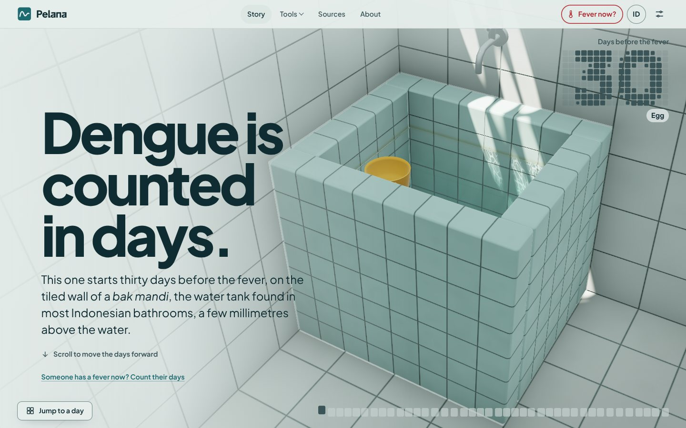
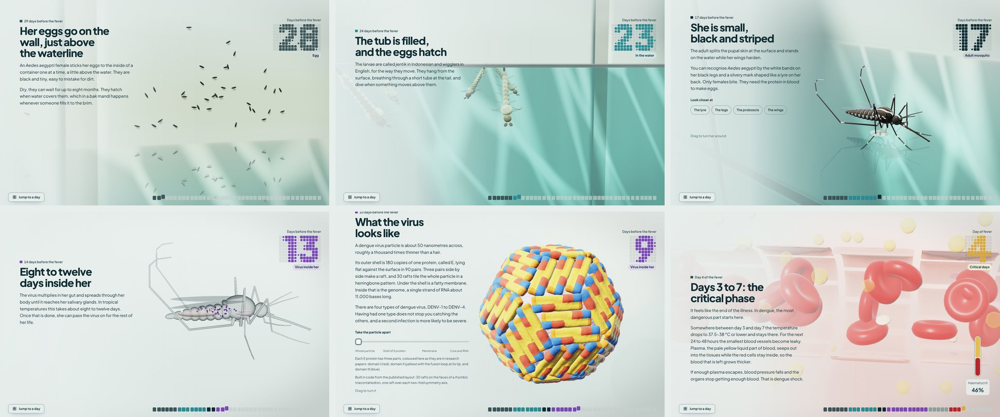
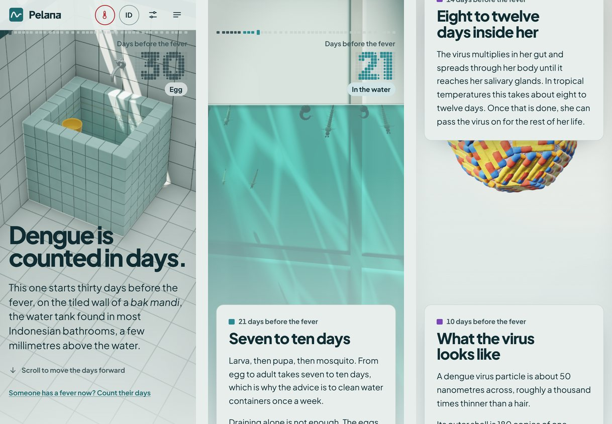
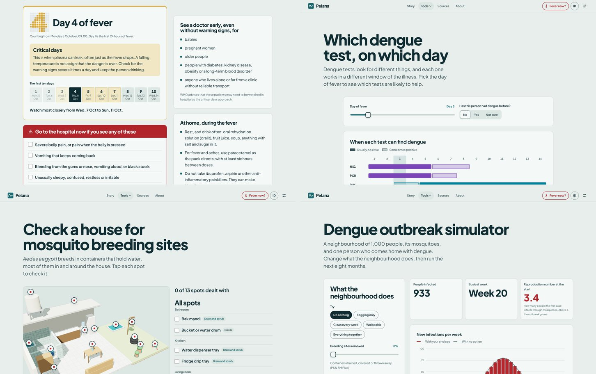

# Pelana

Dengue, counted in days. A scroll story and four free tools about dengue fever, in Indonesian and English, made by Raffa Gamadan Rifandi, a medical student at Universitas Sriwijaya in Palembang.



Dengue is an illness you manage by counting days. The fever usually lasts two to seven days, and the dangerous part comes as it falls, somewhere between day 3 and day 7, when plasma can leak out of the smallest blood vessels. In Indonesia the course of the illness is called *siklus pelana kuda*, the horse-saddle cycle, after the shape of the fever curve. *Pelana* is the saddle.

The story starts thirty days before the fever, with eggs on the wall of a *bak mandi*, the water tank in most Indonesian bathrooms. From there it follows one infection day by day: larvae, the adult mosquito, a bite, the virus, the fever, the critical days and recovery. A counter in the corner keeps the day. The tools are for the people who then have to live through those days.

## The story

Every chapter is a day and a 3D scene you can stop on and turn around:

- eggs glued to the tile a few millimetres above the waterline;
- larvae and pupae under the surface, seen with the camera half in and half out of the water;
- the adult mosquito, with close-ups of the lyre on her back, the white bands on her legs, the proboscis and the wings;
- the eight to twelve days the virus spends inside her, as an X-ray;
- the virus particle, built from its published structure, which you can take apart layer by layer;
- a small blood vessel in the critical phase, where plasma seeps out and the blood left behind thickens.



On a phone the text comes up in cards from the bottom and the scene stays in view above it.



## The tools

- **Count the fever days** works out which day of fever someone is on, what usually happens on that day, and the calendar dates of the critical days. It keeps a temperature log and can put the days in your calendar.
- **Which test, which day** shows when NS1, PCR, IgM and IgG can find dengue, day by day, and how that changes for someone who has had dengue before.
- **House check** goes through a 3D house with thirteen places where mosquitoes breed and what to do about each one, then makes a weekly reminder for your calendar or a checklist to print.
- **Outbreak simulator** runs a host and vector model of 1,000 people and their mosquitoes. Remove breeding sites, release Wolbachia mosquitoes, vaccinate or fog, and compare the outbreak with doing nothing.



What you type stays on your device. Every page works offline after the first visit.

Pelana is for learning. It cannot diagnose anyone and it does not replace a doctor. If someone with dengue has severe belly pain, keeps vomiting, bleeds, is very thirsty, becomes unusually sleepy or restless, has cold and clammy hands and feet, passes no urine for 4 to 6 hours or breathes fast, take them to a hospital now. In Indonesia, call 119.

## How it is built

There are no frameworks and no runtime dependencies. The site is TypeScript, CSS and GLSL written for this project and bundled with esbuild.

The 3D runs on a small WebGL2 renderer made for the site: instanced meshes, shadow mapping, multisampled render targets, physically based shading with an ACES tone curve, and a render resolution that adjusts itself to hold the frame rate. None of the models are files. They are built in code when the page opens:

- the mosquito is assembled from ellipsoids and tapered segments, and her legs are placed by inverse kinematics so the feet land on water or on skin;
- the virus particle follows the published structure of mature dengue virus: 180 copies of the E protein in 90 pairs, three pairs to a raft, 30 rafts on the faces of a rhombic triacontahedron, with the membrane, core and RNA inside;
- the bathroom has water that reflects and refracts, sunlight through the concrete ventilation blocks, caustics on the tiles, and a camera that can sit across the waterline.

One scene hands over to the next with a dissolve in the shape of the bathroom tiles. The day counter is tiled as well: the numerals are drawn in the typeface and sampled onto a grid.

The pages come from a small static site generator in this repository, with one set of templates for both languages. The output is plain HTML that reads as a long article without JavaScript; the 3D and the tools are added on top. Beyond that:

- a strict Content Security Policy, with no inline styles and one hashed inline script;
- installable as an app, with a service worker for offline use;
- settings for colours, text size, contrast, motion and sound, kept on the device;
- motion follows the system's reduced-motion setting, and sound stays off until you turn it on;
- structured data, a sitemap covering both languages, and a social preview image for each language.

The facts come from the WHO dengue guidelines, the Indonesian Ministry of Health and peer-reviewed papers. The full list, with links, is on the Sources page of the site and in `src/content/sources.ts`.

## Running it

You need Node.js 22.18 or later.

```sh
npm install
npm run dev      # http://localhost:4173, rebuilds and reloads when you save
npm run build    # writes the site to dist/
npm run check    # type check
npm test         # unit tests
```

`npm run e2e` drives the built site in a real browser. It needs Playwright, which is not a dependency of the project; the comment at the top of `e2e/run.mjs` says how to install it.

## Deploying

`netlify.toml` has what Netlify needs: it runs `npm run build` and publishes `dist`. The build writes the security headers and the redirect for the bare domain, which sends Indonesian browsers to `/id/` and everyone else to `/en/`. It reads Netlify's `URL` variable, so canonical links and the sitemap point at the address the site is deployed to.

## Layout

```
src/client/gl        WebGL renderer: context, meshes, geometry, camera, shaders
src/client/stage     the 3D worlds of the story and the house diorama
src/client/story     scrolling, the day counter and the chapters
src/client/entries   one script per page
src/site             static site generator and page templates
src/content          all text, in en.ts and id.ts, and the sources
src/shared           logic the tests share: fever days, calendar files, the outbreak model
src/styles           CSS, in cascade layers
scripts              build, dev server, font subsetting, icons and social images
tests, e2e           unit tests and browser tests
```

## Bahasa Indonesia

Pelana adalah cerita bergulir dan empat alat gratis tentang demam berdarah dengue, dalam bahasa Indonesia dan Inggris, karya Raffa Gamadan Rifandi, mahasiswa kedokteran Universitas Sriwijaya. Ceritanya dimulai tiga puluh hari sebelum demam, dari telur nyamuk di dinding bak mandi, lalu mengikuti satu infeksi hari demi hari sampai masa kritis dan pemulihan. Alatnya: hitung hari demam, tes apa di hari ke berapa, cek rumah untuk tempat nyamuk berkembang biak, dan simulasi wabah.

Pelana dibuat untuk belajar dan tidak bisa mendiagnosis siapa pun. Jika muncul tanda bahaya, segera bawa ke rumah sakit. Keadaan darurat medis di Indonesia: hubungi 119.

## Licence

Copyright (c) 2026 Raffa Gamadan Rifandi. All rights reserved.

This is not open source. You may read the code here and use the website, but you may not copy, modify, host or redistribute any part of it, or use it to train AI models, without written permission. The full terms, in English and Indonesian, are in [LICENSE](LICENSE). The typeface, Plus Jakarta Sans, keeps its own SIL Open Font License; see [NOTICE](NOTICE).

Hak cipta (c) 2026 Raffa Gamadan Rifandi. Seluruh hak dilindungi undang-undang. Ketentuan lengkapnya ada di [LICENSE](LICENSE).
